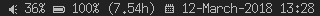

Gopher-Dwm-Bar.

Small status bar for dwm written in go.

System Dependencies:
- amixer

- fonts (here I use siji fonts on top of my default -wuncon-siji-medium-r-normal--10-100-75-75-c-80-iso10646-1", see configuration.json)

Screenshots:

